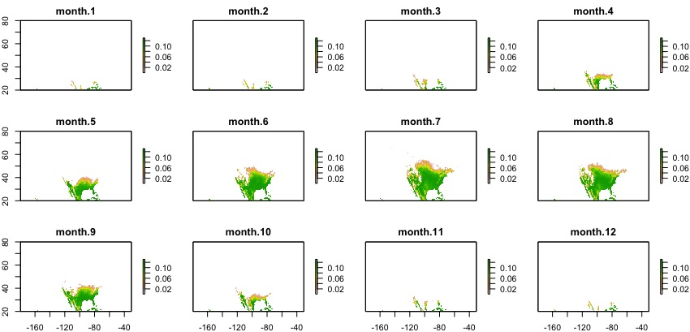

```{r setup, include=FALSE}
knitr::opts_chunk$set(echo = TRUE)
library(knitr)
library(kableExtra)
library(xtable)
options(knitr.table.format = "latex")
```

This markdown file gives updates of progress on the demographic modeling. The most recent postings are at the top.

# 1 June 2019

## Medfly life table construction

We began with the life history data  in Tables 3 and 4 of:

>Vargas, R.I., W.A. Walsh, D. Kanehisa,  J.D. Stark, and T. Nishida. 2000. Annals of the Entomologial Society of America 93: 75-81.

These authors raised flies at 4 different temperatures and constructed age-structured life tables with $l_x$ and $m_x$ data for deaths and births. Unfortunately, the full life tables were not presented, so we were forced to work with summary statistics, such as median $l_x$ values. We were able to assemble them into a 4-stage life history model. For example, here is our derived stage-transition matrix for flies raised at 
$18.5^\circ$ C:

```{r, echo=FALSE}
life_table <- matrix(c(0,0.970,0,0,0,0,0.887,0,0,0,0,1.000,1.350,0,0,0),nrow=4)
row.names(life_table) <- c("Egg","Larva","Pupa","Adult")
colnames(life_table) <- c("Egg","Larva","Pupa","Adult")
kable(life_table, "latex",  booktabs = T,digits=3) %>% kable_styling(latex_options = c("striped", "hold_position"))
```

The problem with this life table is that we have forced the medfly life history into an age-structured model in which each of the 4 life history stages lasts exactly one day. At the end of the day, an individual either dies or advances to the next stage.

Corey is working on an elegant solution to this problem that uses information on the average length of each stage. But for now, this is the only life table that we could construct for the medfly summary data. 

In our model, we have 4 such matrices (one for each temperature treatment). As described in the google-docs, we next pulled out the four non-zero life history parameters for this model. For each parameter, we fit an OLS quadratic regression model to the relationship between the life history parameter and the temperature. This model allows us to predict each of the 4 life history transitions as a function of temperature. Those 4 predictions are dropped into the matrix model, and the population growth rate $\lambda$ is derived. I am calling this the `vital rates model`.

Because of the obvious distortions to the life history in the `vital rates model`, I decided to construct a much simpler forecasting model for these data. Although Vargas et al. (2000) do not give all the life history data we need, they do give the 4 final lambda values (one for each temperature) derived from their life history calculations. I used those 4 estimates in a much simpler `lambda model`. In this case, I simply fit the quadratic regression directly to their reported lambda values without creating or analyzing a life table.

## Comparison of predictions from `vital rates model` and `lambda model`

Here is a graph of the predictions from each of the two models as a function of temperature. The graph looks a little odd because I clipped values less than 1.0 to 0.0 so that Matt's spatial maps would be easier to read. I also superimposed the 4 $\lambda$ values that were used to fit the `lambda model`.


There are some differences between these models. The `vital rates model` predicts much faster population growth rates at most temperatures, but it also generates a range of viable temperatures ($\lambda > 1.0$) that is $3^\circ$ narrower than the range predicted by the `lambda model`.

In spite of this difference, the predictions from the monthly and total maps (see below) did not appear that different for the two models. But for our paper, I think we should stick with the `lambda model`. It is the very simplest demographic prediction model that is possible: no life history details are needed, just values of $\lambda$ measured at different temperatures (or other environmental variables).

That should make a nice lead-in to the cheatgrass analyses, where I will again set up the `vital rates model` and the `lambda model`, this time with snowpack as the driver variable.





