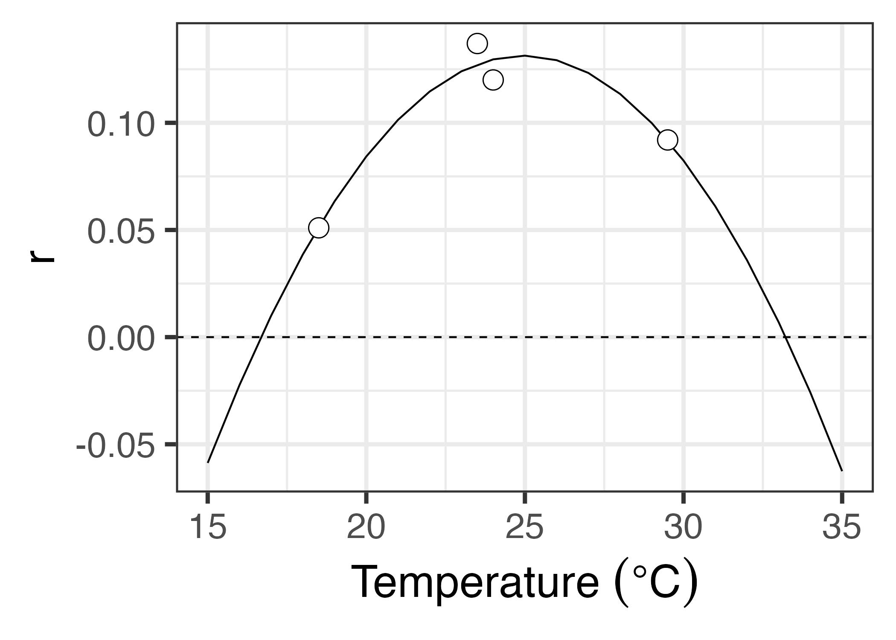
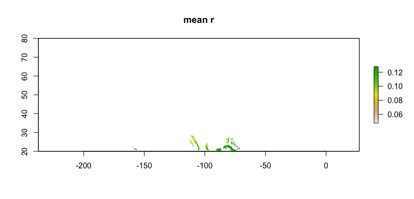

```{r setup, include=FALSE}
knitr::opts_chunk$set(echo = TRUE)
```

This markdown file gives updates of progress on the demographic modeling. The most recent postings are at the top.

# 31 May 2019





